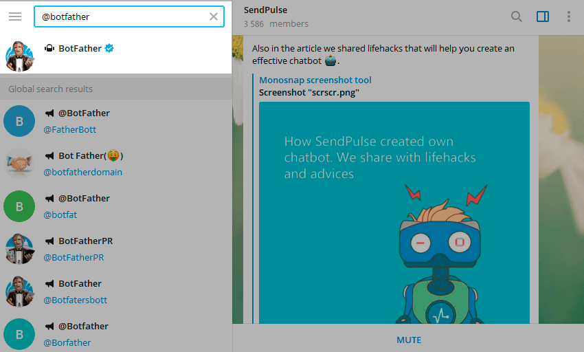
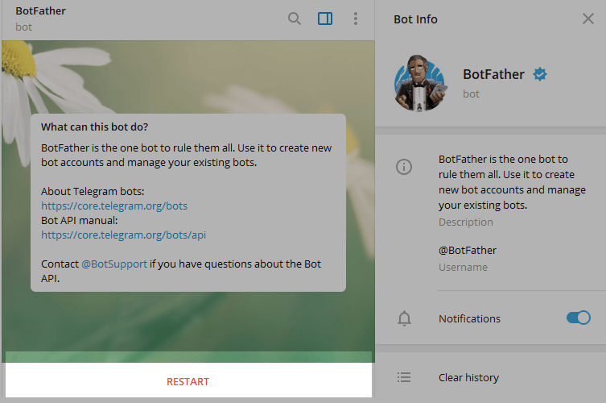
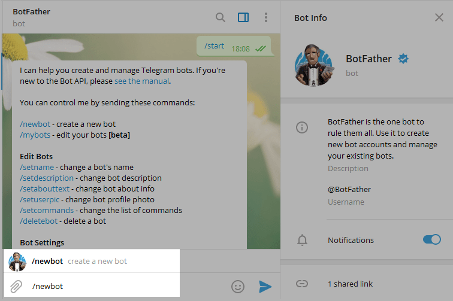
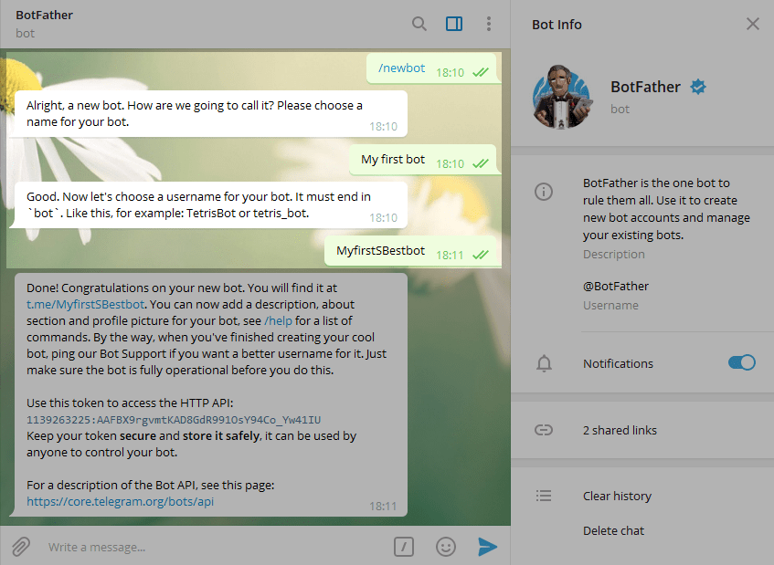
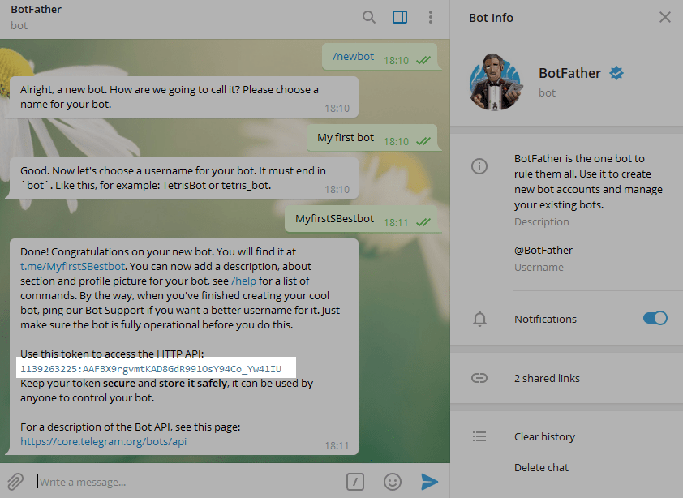
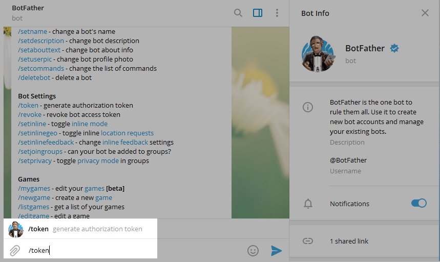
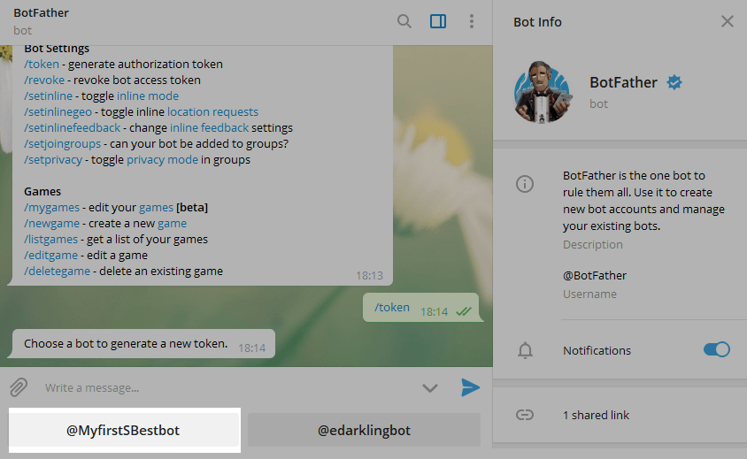
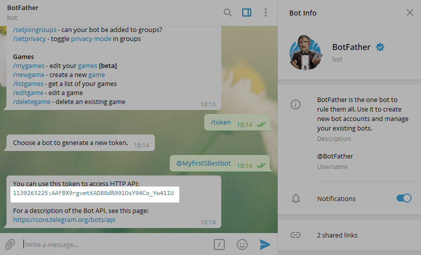

# **Cómo crear un nuevo chatbot de Telegram**

Ve a [Telegram](https://telegram.org/apps), inicia sesión en tu cuenta o crea una nueva.

Escribe @BotFather en el campo de búsqueda y ve a ese bot.

Los chatbots oficiales de Telegram tienen una marca de verificación azul junto a su nombre.

Haz clic en **Comenzar** para activar el chatbot BotFather.

Recibirás una lista de comandos que puedes usar para administrar bots.

Selecciona o escribe el comando /newbot y envíalo.

Elige un nombre para tu bot, será un nombre público. El nombre de usuario de tu bot debe ser único y terminar con la palabra "bot".

Una vez que elijas un nombre para tu chatbot, este se creará. Recibirás un mensaje con un enlace a tu bot (t.me/<bot\_username>) recomendaciones sobre cómo configurar una imagen de perfil, una descripción y una lista de comandos que puedes usar para administrar tu nuevo bot.

Para conectar tu bot a Bitwarden-Export, necesitas un token. Copia el valor de tu token y conservalo para la configuración del servicio.

## **Cómo encontrar un token para un bot existente**

Ve al bot @BotFather y envía el comando /token.

Verás botones con tus bots existentes.

Selecciona el bot requerido para que puedas conectarlo a Bitwarden-Export.

Copia el valor de tu token.

